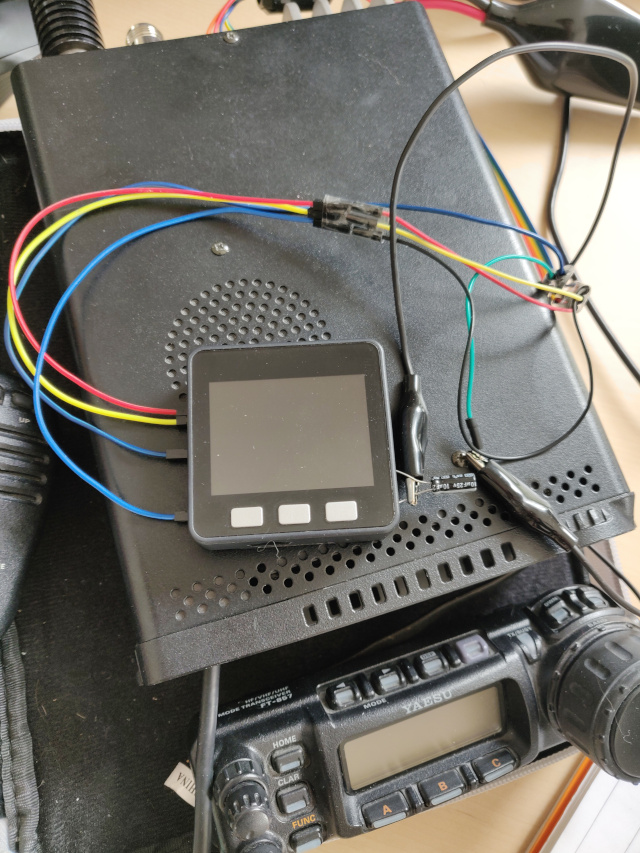

# HamRadio-M5Stack-Logger
Ham-radio contact logger with M5 Stack (save on SD Card, CQ MP3, Web interface, CAT with Yaesu FT857).
[Link to a demo video](https://video.ploud.fr/videos/watch/e269a7b3-5428-4ac4-ac67-fcc64f55a068)

## Working
- Playing files from SD Card
- Control CAT of Yaesu FT857

## Todo
- Logger with Bluetooth keyboard ?
- Web Interface (control + logger + manage audio files on SD Card)
